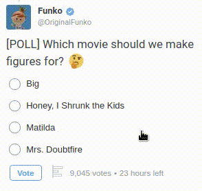

	
	 
	 
	<h4> Twitter: Show results of a poll</h4>
	

    The extension helps users to see results of a poll without a vote.
	

	 

	    
	   
   

 
 

## Preview
The extension is compatible with **TweetDeck** and standard **Web Client**  

## Collaboration

Please, feel free to ask any questions that you have about using and developing the extension.

---
Good luck.
